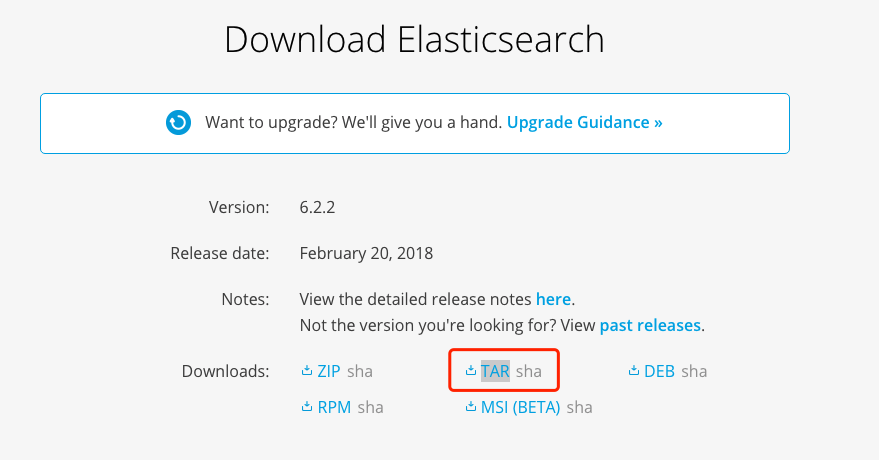

# 2-1 ES版本历史和选择

# 安装

## 版本问题

* 版本历史

  1.x -> 2.x -> 5.x

* 版本选择

## 单实例安装

* 下载页面：https://www.elastic.co/downloads/elasticsearch

* 鼠标右键，获取下载地址

  

* 下载命令：`wget https://artifacts.elastic.co/downloads/elasticsearch/elasticsearch-6.2.2.tar.gz`

  > 为何我下载速度这么慢... 😭
  > elasticsearch-6.2.2.tar.gz        24%[=============>                                             ]   6.85M  23.8KB/s    eta 14m 15s

* 解压命令：`tar -vxf elasticsearch-6.2.2.tar.gz`

* 启动命令：`sh ./bin/elasticsearch`

* 验证启动

  打开浏览器，访问：http://localhost:9200/

  ```
  {
    "name" : "mF4GZ8u",
    "cluster_name" : "elasticsearch",
    "cluster_uuid" : "fE_Ex2l5SrS11AbWZYHvBA",
    "version" : {
      "number" : "6.2.2",
      "build_hash" : "10b1edd",
      "build_date" : "2018-02-16T19:01:30.685723Z",
      "build_snapshot" : false,
      "lucene_version" : "7.2.1",
      "minimum_wire_compatibility_version" : "5.6.0",
      "minimum_index_compatibility_version" : "5.0.0"
    },
    "tagline" : "You Know, for Search"
  }
  ```

## 详细步骤

```
CorningSunMac:local corning$ mkdir elastic
CorningSunMac:local corning$ cd elastic/
CorningSunMac:elastic corning$ wget https://artifacts.elastic.co/downloads/elasticsearch/elasticsearch-6.2.2.tar.gz
--2018-02-24 17:57:54--  https://artifacts.elastic.co/downloads/elasticsearch/elasticsearch-6.2.2.tar.gz
Resolving artifacts.elastic.co... 23.23.109.100, 184.72.242.47, 184.73.245.233, ...
Connecting to artifacts.elastic.co|23.23.109.100|:443... connected.
HTTP request sent, awaiting response... 200 OK
Length: 29049540 (28M) [application/x-gzip]
Saving to: ‘elasticsearch-6.2.2.tar.gz’

elasticsearch-6.2.2.tar.gz       100%[==========================================================>]  27.70M  32.4KB/s    in 17m 57s

2018-02-24 18:15:56 (26.3 KB/s) - ‘elasticsearch-6.2.2.tar.gz’ saved [29049540/29049540]

CorningSunMac:elastic corning$ ls
elasticsearch-6.2.2.tar.gz
CorningSunMac:elastic corning$ tar -vxf elasticsearch-6.2.2.tar.gz
x elasticsearch-6.2.2/
x elasticsearch-6.2.2/lib/
x elasticsearch-6.2.2/lib/elasticsearch-6.2.2.jar
x elasticsearch-6.2.2/lib/elasticsearch-core-6.2.2.jar
x elasticsearch-6.2.2/lib/lucene-core-7.2.1.jar
x elasticsearch-6.2.2/lib/lucene-analyzers-common-7.2.1.jar
x elasticsearch-6.2.2/lib/lucene-backward-codecs-7.2.1.jar
x elasticsearch-6.2.2/lib/lucene-grouping-7.2.1.jar
x elasticsearch-6.2.2/lib/lucene-highlighter-7.2.1.jar
x elasticsearch-6.2.2/lib/lucene-join-7.2.1.jar
x elasticsearch-6.2.2/lib/lucene-memory-7.2.1.jar
x elasticsearch-6.2.2/lib/lucene-misc-7.2.1.jar
x elasticsearch-6.2.2/lib/lucene-queries-7.2.1.jar
x elasticsearch-6.2.2/lib/lucene-queryparser-7.2.1.jar
x elasticsearch-6.2.2/lib/lucene-sandbox-7.2.1.jar
x elasticsearch-6.2.2/lib/lucene-spatial-7.2.1.jar
x elasticsearch-6.2.2/lib/lucene-spatial-extras-7.2.1.jar
x elasticsearch-6.2.2/lib/lucene-spatial3d-7.2.1.jar
x elasticsearch-6.2.2/lib/lucene-suggest-7.2.1.jar
x elasticsearch-6.2.2/lib/securesm-1.2.jar
x elasticsearch-6.2.2/lib/hppc-0.7.1.jar
x elasticsearch-6.2.2/lib/joda-time-2.9.9.jar
x elasticsearch-6.2.2/lib/snakeyaml-1.17.jar
x elasticsearch-6.2.2/lib/jackson-core-2.8.10.jar
x elasticsearch-6.2.2/lib/jackson-dataformat-smile-2.8.10.jar
x elasticsearch-6.2.2/lib/jackson-dataformat-yaml-2.8.10.jar
x elasticsearch-6.2.2/lib/jackson-dataformat-cbor-2.8.10.jar
x elasticsearch-6.2.2/lib/t-digest-3.0.jar
x elasticsearch-6.2.2/lib/HdrHistogram-2.1.9.jar
x elasticsearch-6.2.2/lib/spatial4j-0.6.jar
x elasticsearch-6.2.2/lib/jts-1.13.jar
x elasticsearch-6.2.2/lib/log4j-api-2.9.1.jar
x elasticsearch-6.2.2/lib/log4j-core-2.9.1.jar
x elasticsearch-6.2.2/lib/log4j-1.2-api-2.9.1.jar
x elasticsearch-6.2.2/lib/jna-4.5.1.jar
x elasticsearch-6.2.2/lib/elasticsearch-cli-6.2.2.jar
x elasticsearch-6.2.2/lib/jopt-simple-5.0.2.jar
x elasticsearch-6.2.2/lib/plugin-classloader-6.2.2.jar
x elasticsearch-6.2.2/lib/elasticsearch-launchers-6.2.2.jar
x elasticsearch-6.2.2/lib/plugin-cli-6.2.2.jar
x elasticsearch-6.2.2/config/
x elasticsearch-6.2.2/config/elasticsearch.yml
x elasticsearch-6.2.2/config/jvm.options
x elasticsearch-6.2.2/config/log4j2.properties
x elasticsearch-6.2.2/bin/
x elasticsearch-6.2.2/bin/elasticsearch-env
x elasticsearch-6.2.2/bin/elasticsearch
x elasticsearch-6.2.2/bin/elasticsearch-plugin
x elasticsearch-6.2.2/bin/elasticsearch-translog
x elasticsearch-6.2.2/bin/elasticsearch-keystore
x elasticsearch-6.2.2/bin/elasticsearch-env.bat
x elasticsearch-6.2.2/bin/elasticsearch-keystore.bat
x elasticsearch-6.2.2/bin/elasticsearch-service.bat
x elasticsearch-6.2.2/bin/elasticsearch.bat
x elasticsearch-6.2.2/bin/elasticsearch-translog.bat
x elasticsearch-6.2.2/bin/elasticsearch-plugin.bat
x elasticsearch-6.2.2/README.textile
x elasticsearch-6.2.2/LICENSE.txt
x elasticsearch-6.2.2/NOTICE.txt
x elasticsearch-6.2.2/bin/elasticsearch-service-mgr.exe
x elasticsearch-6.2.2/bin/elasticsearch-service-x64.exe
x elasticsearch-6.2.2/modules/
x elasticsearch-6.2.2/modules/reindex/
x elasticsearch-6.2.2/modules/reindex/reindex-6.2.2.jar
x elasticsearch-6.2.2/modules/reindex/httpcore-4.4.5.jar
x elasticsearch-6.2.2/modules/reindex/httpcore-nio-4.4.5.jar
x elasticsearch-6.2.2/modules/reindex/plugin-security.policy
x elasticsearch-6.2.2/modules/reindex/elasticsearch-rest-client-6.2.2.jar
x elasticsearch-6.2.2/modules/reindex/commons-logging-1.1.3.jar
x elasticsearch-6.2.2/modules/reindex/httpasyncclient-4.1.2.jar
x elasticsearch-6.2.2/modules/reindex/plugin-descriptor.properties
x elasticsearch-6.2.2/modules/reindex/httpclient-4.5.2.jar
x elasticsearch-6.2.2/modules/reindex/commons-codec-1.10.jar
x elasticsearch-6.2.2/modules/rank-eval/
x elasticsearch-6.2.2/modules/rank-eval/rank-eval-6.2.2.jar
x elasticsearch-6.2.2/modules/rank-eval/plugin-descriptor.properties
x elasticsearch-6.2.2/modules/lang-painless/
x elasticsearch-6.2.2/modules/lang-painless/antlr4-runtime-4.5.3.jar
x elasticsearch-6.2.2/modules/lang-painless/plugin-security.policy
x elasticsearch-6.2.2/modules/lang-painless/lang-painless-6.2.2.jar
x elasticsearch-6.2.2/modules/lang-painless/plugin-descriptor.properties
x elasticsearch-6.2.2/modules/lang-painless/elasticsearch-scripting-painless-spi-6.2.2.jar
x elasticsearch-6.2.2/modules/lang-painless/asm-debug-all-5.1.jar
x elasticsearch-6.2.2/modules/repository-url/
x elasticsearch-6.2.2/modules/repository-url/plugin-security.policy
x elasticsearch-6.2.2/modules/repository-url/plugin-descriptor.properties
x elasticsearch-6.2.2/modules/repository-url/repository-url-6.2.2.jar
x elasticsearch-6.2.2/modules/percolator/
x elasticsearch-6.2.2/modules/percolator/plugin-descriptor.properties
x elasticsearch-6.2.2/modules/percolator/percolator-6.2.2.jar
x elasticsearch-6.2.2/modules/tribe/
x elasticsearch-6.2.2/modules/tribe/tribe-6.2.2.jar
x elasticsearch-6.2.2/modules/tribe/plugin-descriptor.properties
x elasticsearch-6.2.2/modules/aggs-matrix-stats/
x elasticsearch-6.2.2/modules/aggs-matrix-stats/aggs-matrix-stats-6.2.2.jar
x elasticsearch-6.2.2/modules/aggs-matrix-stats/plugin-descriptor.properties
x elasticsearch-6.2.2/modules/transport-netty4/
x elasticsearch-6.2.2/modules/transport-netty4/netty-codec-4.1.16.Final.jar
x elasticsearch-6.2.2/modules/transport-netty4/netty-buffer-4.1.16.Final.jar
x elasticsearch-6.2.2/modules/transport-netty4/netty-common-4.1.16.Final.jar
x elasticsearch-6.2.2/modules/transport-netty4/netty-codec-http-4.1.16.Final.jar
x elasticsearch-6.2.2/modules/transport-netty4/transport-netty4-6.2.2.jar
x elasticsearch-6.2.2/modules/transport-netty4/plugin-security.policy
x elasticsearch-6.2.2/modules/transport-netty4/plugin-descriptor.properties
x elasticsearch-6.2.2/modules/transport-netty4/netty-resolver-4.1.16.Final.jar
x elasticsearch-6.2.2/modules/transport-netty4/netty-transport-4.1.16.Final.jar
x elasticsearch-6.2.2/modules/transport-netty4/netty-handler-4.1.16.Final.jar
x elasticsearch-6.2.2/modules/ingest-common/
x elasticsearch-6.2.2/modules/ingest-common/joni-2.1.6.jar
x elasticsearch-6.2.2/modules/ingest-common/ingest-common-6.2.2.jar
x elasticsearch-6.2.2/modules/ingest-common/plugin-descriptor.properties
x elasticsearch-6.2.2/modules/ingest-common/jcodings-1.0.12.jar
x elasticsearch-6.2.2/modules/analysis-common/
x elasticsearch-6.2.2/modules/analysis-common/plugin-descriptor.properties
x elasticsearch-6.2.2/modules/analysis-common/analysis-common-6.2.2.jar
x elasticsearch-6.2.2/modules/parent-join/
x elasticsearch-6.2.2/modules/parent-join/plugin-descriptor.properties
x elasticsearch-6.2.2/modules/parent-join/parent-join-6.2.2.jar
x elasticsearch-6.2.2/modules/lang-mustache/
x elasticsearch-6.2.2/modules/lang-mustache/plugin-security.policy
x elasticsearch-6.2.2/modules/lang-mustache/lang-mustache-6.2.2.jar
x elasticsearch-6.2.2/modules/lang-mustache/plugin-descriptor.properties
x elasticsearch-6.2.2/modules/lang-mustache/compiler-0.9.3.jar
x elasticsearch-6.2.2/modules/mapper-extras/
x elasticsearch-6.2.2/modules/mapper-extras/plugin-descriptor.properties
x elasticsearch-6.2.2/modules/mapper-extras/mapper-extras-6.2.2.jar
x elasticsearch-6.2.2/modules/lang-expression/
x elasticsearch-6.2.2/modules/lang-expression/asm-5.0.4.jar
x elasticsearch-6.2.2/modules/lang-expression/lucene-expressions-7.2.1.jar
x elasticsearch-6.2.2/modules/lang-expression/plugin-security.policy
x elasticsearch-6.2.2/modules/lang-expression/asm-commons-5.0.4.jar
x elasticsearch-6.2.2/modules/lang-expression/asm-tree-5.0.4.jar
x elasticsearch-6.2.2/modules/lang-expression/antlr4-runtime-4.5.1-1.jar
x elasticsearch-6.2.2/modules/lang-expression/plugin-descriptor.properties
x elasticsearch-6.2.2/modules/lang-expression/lang-expression-6.2.2.jar
x elasticsearch-6.2.2/plugins/
x elasticsearch-6.2.2/logs/
CorningSunMac:elastic corning$ ls
elasticsearch-6.2.2		elasticsearch-6.2.2.tar.gz
CorningSunMac:elastic corning$ cd elasticsearch-6.2.2
CorningSunMac:elasticsearch-6.2.2 corning$ ls
LICENSE.txt	README.textile	config		logs		plugins
NOTICE.txt	bin		lib		modules
CorningSunMac:elasticsearch-6.2.2 corning$ java -version
java version "9"
Java(TM) SE Runtime Environment (build 9+181)
Java HotSpot(TM) 64-Bit Server VM (build 9+181, mixed mode)
CorningSunMac:elasticsearch-6.2.2 corning$ ls ./bin/
elasticsearch                  elasticsearch-keystore.bat     elasticsearch-service-x64.exe  elasticsearch.bat
elasticsearch-env              elasticsearch-plugin           elasticsearch-service.bat
elasticsearch-env.bat          elasticsearch-plugin.bat       elasticsearch-translog
elasticsearch-keystore         elasticsearch-service-mgr.exe  elasticsearch-translog.bat
CorningSunMac:elasticsearch-6.2.2 corning$ sh ./bin/elasticsearch
Java HotSpot(TM) 64-Bit Server VM warning: Option UseConcMarkSweepGC was deprecated in version 9.0 and will likely be removed in a future release.
[2018-02-26T09:20:35,768][INFO ][o.e.n.Node               ] [] initializing ...
[2018-02-26T09:20:35,860][INFO ][o.e.e.NodeEnvironment    ] [mF4GZ8u] using [1] data paths, mounts [[/ (/dev/disk1s1)]], net usable_space [108.8gb], net total_space [465.7gb], types [apfs]
[2018-02-26T09:20:35,860][INFO ][o.e.e.NodeEnvironment    ] [mF4GZ8u] heap size [989.8mb], compressed ordinary object pointers [true]
[2018-02-26T09:20:35,863][INFO ][o.e.n.Node               ] node name [mF4GZ8u] derived from node ID [mF4GZ8u0T8eKC8iHNzTt_w]; set [node.name] to override
[2018-02-26T09:20:35,863][INFO ][o.e.n.Node               ] version[6.2.2], pid[10992], build[10b1edd/2018-02-16T19:01:30.685723Z], OS[Mac OS X/10.13.3/x86_64], JVM[Oracle Corporation/Java HotSpot(TM) 64-Bit Server VM/9/9+181]
[2018-02-26T09:20:35,863][INFO ][o.e.n.Node               ] JVM arguments [-Xms1g, -Xmx1g, -XX:+UseConcMarkSweepGC, -XX:CMSInitiatingOccupancyFraction=75, -XX:+UseCMSInitiatingOccupancyOnly, -XX:+AlwaysPreTouch, -Xss1m, -Djava.awt.headless=true, -Dfile.encoding=UTF-8, -Djna.nosys=true, -XX:-OmitStackTraceInFastThrow, -Dio.netty.noUnsafe=true, -Dio.netty.noKeySetOptimization=true, -Dio.netty.recycler.maxCapacityPerThread=0, -Dlog4j.shutdownHookEnabled=false, -Dlog4j2.disable.jmx=true, -Djava.io.tmpdir=/var/folders/mg/pxtj807539j2bbfwcmfprsw80000gn/T/elasticsearch.iSw4klBZ, -XX:+HeapDumpOnOutOfMemoryError, -Xlog:gc*,gc+age=trace,safepoint:file=logs/gc.log:utctime,pid,tags:filecount=32,filesize=64m, -Djava.locale.providers=COMPAT, -Des.path.home=/Users/corning/local/elastic/elasticsearch-6.2.2, -Des.path.conf=/Users/corning/local/elastic/elasticsearch-6.2.2/config]
[2018-02-26T09:20:36,336][INFO ][o.e.p.PluginsService     ] [mF4GZ8u] loaded module [aggs-matrix-stats]
[2018-02-26T09:20:36,336][INFO ][o.e.p.PluginsService     ] [mF4GZ8u] loaded module [analysis-common]
[2018-02-26T09:20:36,336][INFO ][o.e.p.PluginsService     ] [mF4GZ8u] loaded module [ingest-common]
[2018-02-26T09:20:36,336][INFO ][o.e.p.PluginsService     ] [mF4GZ8u] loaded module [lang-expression]
[2018-02-26T09:20:36,336][INFO ][o.e.p.PluginsService     ] [mF4GZ8u] loaded module [lang-mustache]
[2018-02-26T09:20:36,337][INFO ][o.e.p.PluginsService     ] [mF4GZ8u] loaded module [lang-painless]
[2018-02-26T09:20:36,337][INFO ][o.e.p.PluginsService     ] [mF4GZ8u] loaded module [mapper-extras]
[2018-02-26T09:20:36,337][INFO ][o.e.p.PluginsService     ] [mF4GZ8u] loaded module [parent-join]
[2018-02-26T09:20:36,337][INFO ][o.e.p.PluginsService     ] [mF4GZ8u] loaded module [percolator]
[2018-02-26T09:20:36,337][INFO ][o.e.p.PluginsService     ] [mF4GZ8u] loaded module [rank-eval]
[2018-02-26T09:20:36,338][INFO ][o.e.p.PluginsService     ] [mF4GZ8u] loaded module [reindex]
[2018-02-26T09:20:36,338][INFO ][o.e.p.PluginsService     ] [mF4GZ8u] loaded module [repository-url]
[2018-02-26T09:20:36,338][INFO ][o.e.p.PluginsService     ] [mF4GZ8u] loaded module [transport-netty4]
[2018-02-26T09:20:36,338][INFO ][o.e.p.PluginsService     ] [mF4GZ8u] loaded module [tribe]
[2018-02-26T09:20:36,338][INFO ][o.e.p.PluginsService     ] [mF4GZ8u] no plugins loaded
[2018-02-26T09:20:38,239][INFO ][o.e.d.DiscoveryModule    ] [mF4GZ8u] using discovery type [zen]
[2018-02-26T09:20:38,658][INFO ][o.e.n.Node               ] initialized
[2018-02-26T09:20:38,658][INFO ][o.e.n.Node               ] [mF4GZ8u] starting ...
[2018-02-26T09:20:38,793][INFO ][o.e.t.TransportService   ] [mF4GZ8u] publish_address {127.0.0.1:9300}, bound_addresses {[::1]:9300}, {127.0.0.1:9300}
[2018-02-26T09:20:41,833][INFO ][o.e.c.s.MasterService    ] [mF4GZ8u] zen-disco-elected-as-master ([0] nodes joined), reason: new_master {mF4GZ8u}{mF4GZ8u0T8eKC8iHNzTt_w}{p83JSVB0SzuGEule4Uo74Q}{127.0.0.1}{127.0.0.1:9300}
[2018-02-26T09:20:41,838][INFO ][o.e.c.s.ClusterApplierService] [mF4GZ8u] new_master {mF4GZ8u}{mF4GZ8u0T8eKC8iHNzTt_w}{p83JSVB0SzuGEule4Uo74Q}{127.0.0.1}{127.0.0.1:9300}, reason: apply cluster state (from master [master {mF4GZ8u}{mF4GZ8u0T8eKC8iHNzTt_w}{p83JSVB0SzuGEule4Uo74Q}{127.0.0.1}{127.0.0.1:9300} committed version [1] source [zen-disco-elected-as-master ([0] nodes joined)]])
[2018-02-26T09:20:41,853][INFO ][o.e.h.n.Netty4HttpServerTransport] [mF4GZ8u] publish_address {127.0.0.1:9200}, bound_addresses {[::1]:9200}, {127.0.0.1:9200}
[2018-02-26T09:20:41,853][INFO ][o.e.n.Node               ] [mF4GZ8u] started
[2018-02-26T09:20:41,879][INFO ][o.e.g.GatewayService     ] [mF4GZ8u] recovered [0] indices into cluster_state

```
