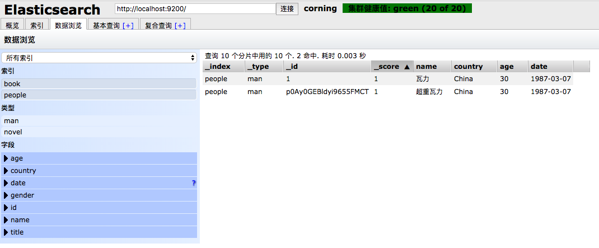

# 4-2 插入

## 指定文档id插入

PUT http://127.0.0.1:9200/people/man/1

* 请求

```json
{
	"name":"瓦力",
	"country":"China",
	"age": 30,
	"date": "1987-03-07"
}
```

* 返回

```json
{
    "_index": "people",
    "_type": "man",
    "_id": "1",
    "_version": 1,
    "result": "created",
    "_shards": {
        "total": 2,
        "successful": 2,
        "failed": 0
    },
    "_seq_no": 0,
    "_primary_term": 1
}
```

## 自动产生文档id插入

POST http://127.0.0.1:9200/people/man

* 请求

```json
{
	"name":"超重瓦力",
	"country":"China",
	"age": 30,
	"date": "1987-03-07"
}
```

* 返回

```json
{
    "_index": "people",
    "_type": "man",
    "_id": "p0Ay0GEBldyi9655FMCT",
    "_version": 1,
    "result": "created",
    "_shards": {
        "total": 2,
        "successful": 2,
        "failed": 0
    },
    "_seq_no": 0,
    "_primary_term": 1
}
```

## 数据插入结果

