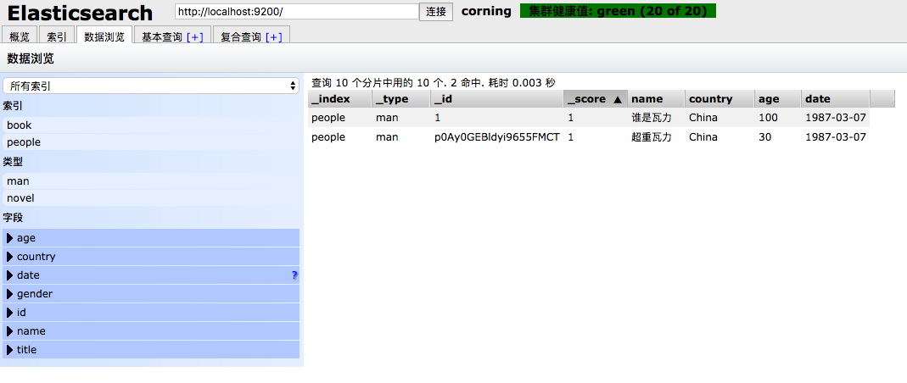

# 4-3 修改


## 直接修改

POST http://127.0.0.1:9200/people/man/1/_update

* 请求

```json
{
    "doc": {
        "name":"谁是瓦力"
    }
}
```

* 返回

```json
{
    "_index": "people",
    "_type": "man",
    "_id": "1",
    "_version": 2,
    "result": "updated",
    "_shards": {
        "total": 2,
        "successful": 2,
        "failed": 0
    },
    "_seq_no": 1,
    "_primary_term": 1
}
```

## 脚本修改1

POST http://127.0.0.1:9200/people/man/1/_update

* 请求

```json
{
    "script": {
        "lang": "painless",
        "inline": "ctx._source.age += 10"
    }
}
```

* 返回

```json
{
    "_index": "people",
    "_type": "man",
    "_id": "1",
    "_version": 3,
    "result": "updated",
    "_shards": {
        "total": 2,
        "successful": 2,
        "failed": 0
    },
    "_seq_no": 2,
    "_primary_term": 1
}
```

## 脚本修改2

POST http://127.0.0.1:9200/people/man/1/_update

* 请求

```json
{
    "script": {
        "lang": "painless",
        "inline": "ctx._source.age = params.age",
        "params": {
            "age": 100
        }
    }
}
```

* 返回

```json
{
    "_index": "people",
    "_type": "man",
    "_id": "1",
    "_version": 4,
    "result": "updated",
    "_shards": {
        "total": 2,
        "successful": 2,
        "failed": 0
    },
    "_seq_no": 3,
    "_primary_term": 1
}
```

## 检查结果



